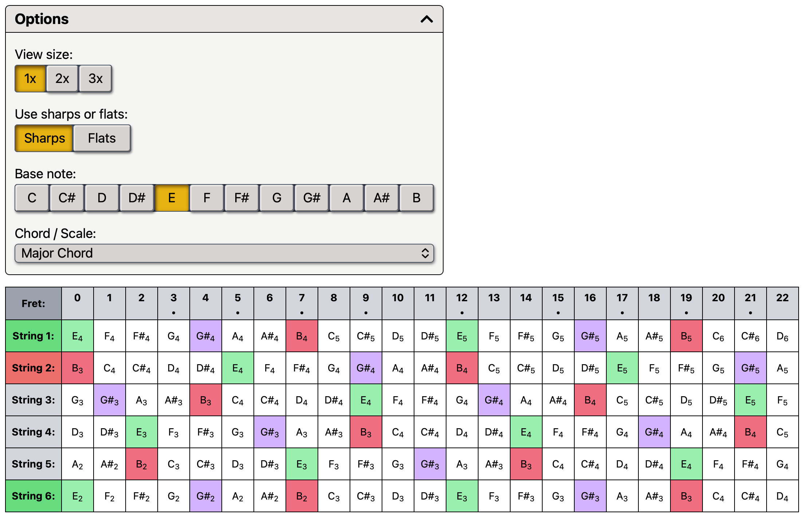
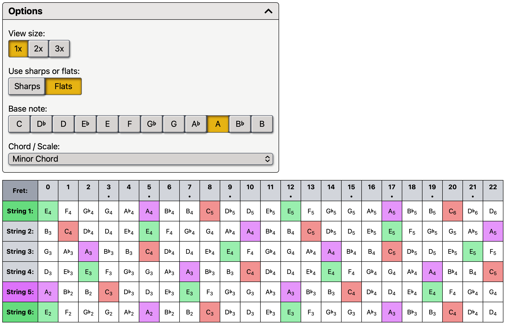

# Guitar Chords and Scales

## Description

A virtual guitar fretboard that allows you to dynamically view all of the most common guitar chords and scales.

## Technologies

This project was created using TypeScript, React, Vite, and Tailwind CSS.

## Screenshots

**E major chord**

    
**A minor chord**
 

## License

This repository uses an [MIT License ↗️](./LICENSE.txt).